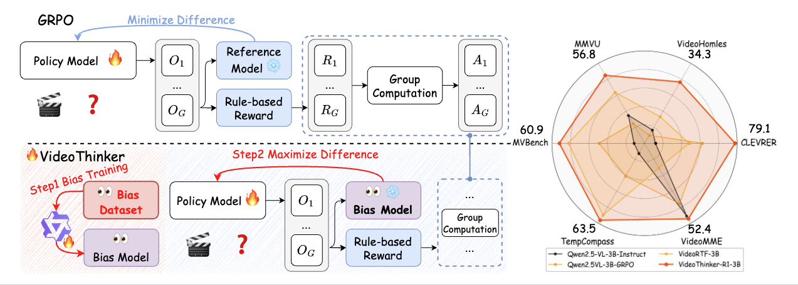
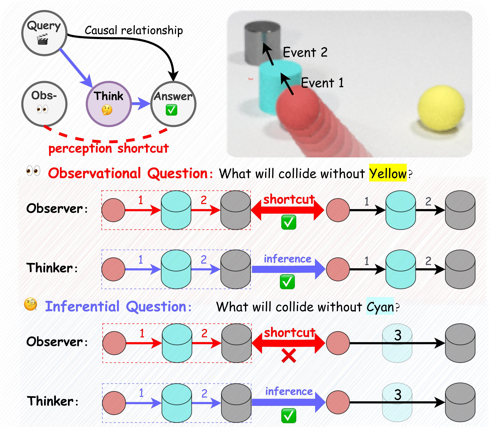
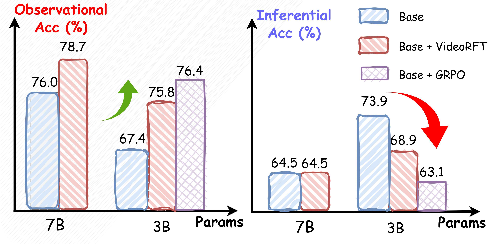
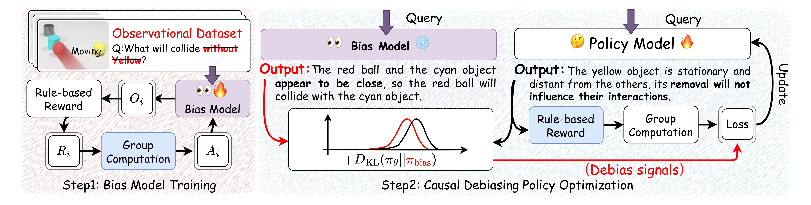

<h1 style="text-align: center;">🎬 VideoThinker: Beyond Perceptual Shortcuts</h1>

<p align="center">
        🤗 <a href="https://huggingface.co/Falconss1/VideoThinker-R1-3B">Model</a> &nbsp&nbsp | &nbsp&nbsp 📑 <a href="https://cvpr.thecvf.com/virtual/2026/poster/37231">Paper</a> &nbsp&nbsp 
</p>

<div align="center">

**🚀 CVPR 2026
"Beyond Perceptual Shortcuts: Causal-Inspired Debiasing Optimization for Generalizable Video Reasoning in Lightweight MLLMs" 🚀**

**[Jingze Wu](https://github.com/falonss703), [Quan Zhang*](mailto:zhangq689@mail.sysu.edu.cn)*, Hongfei Suo, Zeqiang Cai, [Hongbo Chen*](mailto:chenhongbo@mail.sysu.edu.cn)***

**Sun Yat-sen University, China**

*Corresponding authors

</div>

<p align="center">

</p>

**VideoThinker** is a causal-inspired framework that enables lightweight multimodal language models (3B parameters) to achieve robust video reasoning. Using only **1K training samples** and **no SFT**, VideoThinker-R1 surpasses models trained on 110K samples and even outperforms larger 7B models on reasoning-heavy benchmarks.

## 🤔 The Problem: Perceptual Shortcuts in Video Reasoning

Consider this video reasoning scenario from CLEVRER dataset:

<p align="center">

</p>

**Question**: "What will happen if we remove the [object]?"

**Two Types of Questions:**

🟢 **Observational (Easy)**: "What will happen if we remove the yellow ball?"  
→ The yellow ball is causally irrelevant. Model can simply describe what's visible in the video without real reasoning.

🔴 **Inferential (Hard)**: "What will happen if we remove the cyan cylinder?"  
→ The cylinder acts as a causal blocker. Model must perform counterfactual reasoning about an alternative scenario.

### 📊 The Critical Finding

<p align="center">

</p>

We discovered that **74% of training data** consists of observational questions, creating a severe data bias. Our diagnostic experiments reveal:

- ✅ 3B base model (zero-shot): **73.9%** on inferential questions
- ❌ 3B after GRPO fine-tuning: **63.1%** on inferential questions (**-10.8%**)
- ✅ 7B models remain robust (parameter capacity compensates for bias)

**The problem**: Lightweight 3B models learn perceptual shortcuts from biased data, actively **unlearning** their reasoning abilities during RL fine-tuning!

## 💡 Our Solution: VideoThinker

We propose a simple yet effective two-stage framework:

<p align="center">

</p>

**Stage 1: Bias Aware Training**  
Train a "bias model" that explicitly learns perceptual shortcuts (trained only on observational questions).

**Stage 2: Causal Debiasing Policy Optimization (CDPO)**  
Fine-tune the main model to actively **push away** from the bias model's behavior using a repulsive objective, while simultaneously pulling toward correct answers.

💡 **Key Innovation**: We use a **positive** KL-divergence coefficient, which maximizes the distance from the bias model instead of minimizing it. This forces the model to discover genuine reasoning pathways.

**Technical Details**: See our paper for the formal causal analysis (Structural Causal Model) and complete algorithm.

## 📊 Main Results

### 🎥 Demo Video

[](https://github.com/user-attachments/assets/de2b71b6-7837-4f88-b555-73c12524455b)

*Comparison with VideoRFT on multiple video reasoning benchmarks*

### Performance Summary

| Model | Training Data | CLEVRER | MMVU | MVBench | TempCompass | VideoMME |
|-------|---------------|---------|------|---------|-------------|----------|
| Video-UTR-7B | - | - | - | 58.8 | 59.7 | 52.6 |
| Qwen2.5-VL-3B (CoT) | Zero-shot | 44.7 | 52.8 | 49.6 | 30.0 | 52.0 |
| VideoRFT-3B | 110K SFT+RL | 59.3 | 55.1 | 59.5 | 61.0 | 45.4 |
| Qwen2.5-VL-GRPO | 1K RL | 64.9 | 52.0 | 54.9 | 41.4 | 50.3 |
| **VideoThinker-R1** | **1K RL** | **79.1** | **56.8** | **60.9** | **63.5** | **52.4** |

### Key Takeaways

✅ **Sample Efficiency**: Outperforms VideoRFT-3B using only **0.9%** of training data (1K vs 110K)  
✅ **Reasoning Boost**: **+14.2%** over GRPO baseline on CLEVRER (79.1% vs 64.9%)  
✅ **Cross-Scale Win**: Surpasses 7B models on reasoning-heavy benchmarks (MVBench, TempCompass)  
✅ **No SFT Needed**: Direct RL fine-tuning without supervised pre-training

## 🛠️ Setup

> [!NOTE]
> 💻 Training is conducted on 2 x NVIDIA RTX A6000 GPUs (48GB each). Training the bias model and main model (500 steps each) takes approximately 8 hours total.

To implement VideoThinker training, complete these three steps: **dependency installation**, **model backbone download**, and **training dataset download**.

### 🛠️ Step 1: Environment Setup and Dependency Installation

```bash
git clone https://github.com/falonss703/VideoThinker
cd VideoThinker
conda create -n videothinker python=3.10
conda activate videothinker
pip3 install -e ".[dev]"
pip3 install flash_attn --no-build-isolation
git clone https://github.com/huggingface/transformers
cd transformers
git checkout v4.50.0
pip install .
cd ../qwen-vl-utils
pip install -e .
pip install decord
cd ..
```

### 📥 Step 2: Download Model Backbone

Download the Qwen2.5-VL-3B-Instruct model:

```bash
pip install -U huggingface_hub
huggingface-cli download --resume-download Qwen/Qwen2.5-VL-3B-Instruct --local-dir Qwen/Qwen2.5-VL-3B-Instruct
```

### 🎥 Step 3: Download Training Dataset

#### 🧩 CLEVRER (Primary Training Dataset)

We use counterfactual tasks from CLEVRER for training. JSON files are in [`data/CLEVRER`](data/CLEVRER), but you need to download videos:

```bash
# Create directories
mkdir -p data/CLEVRER/{train_video,validation_video}

# Download training videos
wget -P data/CLEVRER/train_video http://data.csail.mit.edu/clevrer/videos/train/video_train.zip
unzip data/CLEVRER/train_video/video_train.zip -d data/CLEVRER/train_video
rm data/CLEVRER/train_video/video_train.zip

# Download validation videos
wget -P data/CLEVRER/validation_video http://data.csail.mit.edu/clevrer/videos/validation/video_validation.zip
unzip data/CLEVRER/validation_video/video_validation.zip -d data/CLEVRER/validation_video
rm data/CLEVRER/validation_video/video_validation.zip
```

#### 🌐 Evaluation Benchmarks

The evaluation datasets are provided with download links below. **If you only want to reproduce CLEVRER results, you can skip this step.**

| 📊 Dataset | 💾 Size | 🔗 Link |
|---------|------|------|
| [CLEVRER](http://clevrer.csail.mit.edu/) | 30GB | [📥 Download](http://clevrer.csail.mit.edu/) |
| [MMVU](https://huggingface.co/datasets/yale-nlp/MMVU) | 0.9GB | [📥 Download](https://huggingface.co/datasets/yale-nlp/MMVU) |
| [Video-Holmes](https://github.com/TencentARC/Video-Holmes) | 5GB | [📥 Download](https://huggingface.co/datasets/TencentARC/Video-Holmes) |
| [MVBench](https://huggingface.co/datasets/OpenGVLab/MVBench) | 16GB | [📥 Download](https://huggingface.co/datasets/OpenGVLab/MVBench) |
| [TempCompass](https://huggingface.co/datasets/lmms-lab/TempCompass) | 0.4GB | [📥 Download](https://huggingface.co/datasets/lmms-lab/TempCompass) |
| [Video-MME](https://huggingface.co/datasets/lmms-lab/Video-MME) | 94GB | [📥 Download](https://huggingface.co/datasets/lmms-lab/Video-MME) |

> 📝 **Important Notes:**
> - JSON files are in [`data/`](data/) directory
> - Organize video data according to standard dataset structures
> - See [`data/README.md`](data/README.md) for detailed directory organization

### 🏃‍♂️ Training

VideoThinker employs a two-stage training process to effectively debias lightweight MLLMs:

#### Stage 1: Bias Aware Training

First, train a dedicated "bias model" that embodies perceptual shortcuts:

```bash
bash scripts/bias_training.sh
```

This stage constructs a model that specifically learns to exploit observational shortcuts in the data, serving as a negative exemplar for the debiasing process. The bias model is trained on observational questions with `beta=0.0`.

#### Stage 2: Causal Debiasing Policy Optimization (CDPO)

Once the bias model is trained, run CDPO to train the main model while actively pushing it away from biased reasoning:

```bash
bash scripts/grpo.sh
```

CDPO employs an innovative repulsive objective using **negative beta coefficient** (`beta=-0.01`), transforming the KL regularizer into a repulsive force that steers the model away from the bias model's shortcuts while attracting it toward correct reasoning.

> [!TIP]
> **Key Configuration Differences:**
> - **Bias Training**: Uses `beta=0.0` and trains on observational questions only
> - **CDPO**: Uses `beta=-0.01` (negative!) and references the bias model via `--ref_model_path`

### ⚙️ Training Configuration Options

We provide convenient parameter settings to help you verify the effects of different designs proposed in the paper:

- **🎚️ Beta Value** (`--beta`):
  - Bias Training: `0.0` (no KL regularization)
  - CDPO: `-0.01` (negative for repulsive objective)
  - Controls the strength of the repulsive force
  - More negative values increase repulsion from the bias model

- **📊 Dataset Selection** (`--jsonl_path`):
  - Bias Training: `data/CLEVRER/clevrer_counterfactual_train_observational_bias_training.json`
  - CDPO: `data/CLEVRER/clevrer_counterfactual_train.json`

- **🎯 Reference Model** (`--ref_model_path`):
  - Only used in CDPO stage
  - Path to the pre-trained bias model
  - Example: `$PRIVATE_DATA_ROOT/Training/Qwen2.5-VL-3B-Instruct_clevrer_counterfactual_bias_model/checkpoint-500`

- **💾 Output Directory** (`--output_dir`):
  - Bias Training: `$PRIVATE_DATA_ROOT/Training/Qwen2.5-VL-3B-Instruct_clevrer_counterfactual_bias_model`
  - CDPO: `$PRIVATE_DATA_ROOT/Training/Qwen2.5-VL-3B-Instruct_clevrer_counterfactual_videothinker_r1`

## 📊 Evaluation

After downloading the datasets and completing training, or downloading our pre-trained model (available at [HuggingFace](https://huggingface.co/falonss703/VideoThinker-R1)), you can evaluate VideoThinker-R1 using:

```bash
bash scripts/eval_bench.sh
```

## 🙏 References & Acknowledgements

We sincerely thank the contributions from the open source community, including the awesome works of [Qwen2-VL](https://github.com/QwenLM/Qwen2-VL), [Video-R1](https://github.com/tulerfeng/Video-R1), [VideoRFT](https://github.com/VideoRFT/VideoRFT), and [CLEVRER](http://clevrer.csail.mit.edu/).

## 📖 Citation

If you find VideoThinker useful in your research, please consider citing our CVPR 2026 paper:

```BibTeX
@inproceedings{wu2026videothinker,
  title={Beyond Perceptual Shortcuts: Causal-Inspired Debiasing Optimization for Generalizable Video Reasoning in Lightweight MLLMs},
  author={Wu, Jingze and Zhang, Quan and Suo, Hongfei and Cai, Zeqiang and Chen, Hongbo},
  booktitle={Proceedings of the IEEE/CVF Conference on Computer Vision and Pattern Recognition (CVPR)},
  year={2026}
}
```

---

<div align="center">

**🌟 Star this repo if you find it helpful! 🌟**

[](https://www.star-history.com/#falonss703/VideoThinker&Date)

</div>